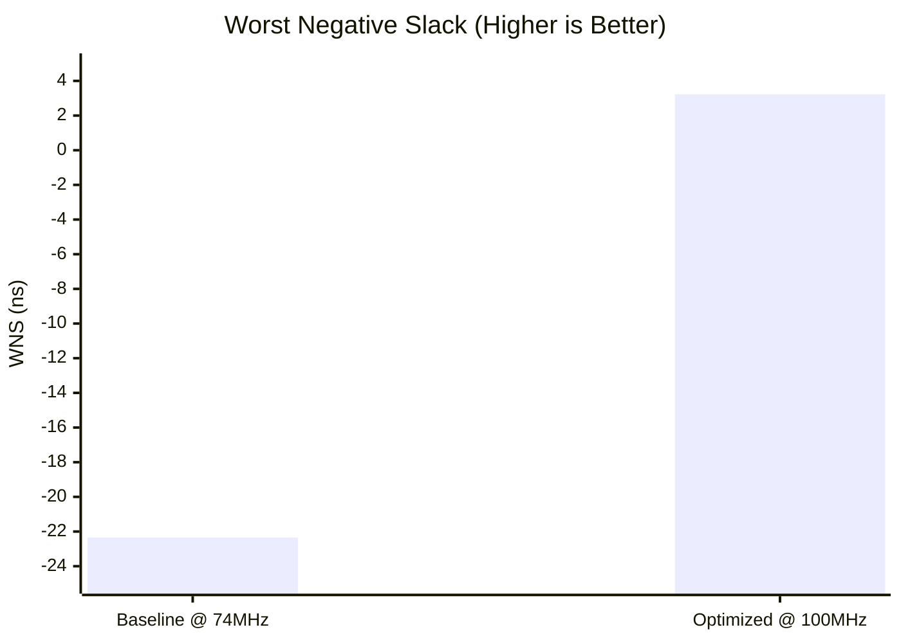

# 64-Tile CLAHE 优化效果深度分析报告 (Optimization Deep Dive) - 基于真实 Vivado 数据

本报告引用了工程 `clahe_vivado_64t` (Baseline) 与 `clahe_vivado_64t_opt` (Optimized) 的 **最新真实 Vivado Implementation Report** 数据。

> **最新更新**: 2025-12-10，包含流水线除法器 (Pipelined Divider) 和 RAM 缓冲区优化

## 1. 核心指标可视化对比 (Visual Summary)

### 1.1 资源消耗 (Resource Utilization) - **全面资源节省**

| 资源 (Resource) | Baseline (64t) | Optimized (64t_opt) | 变化 (Change) |
| :--- | :--- | :--- | :--- |
| **LUTs (Look-Up Tables)** | 8,014 | **3,929** | **⬇️ 51.0%** |
| **Registers (Flip-Flops)** | 637 | **3,104** | ⬆️ 387% (流水线代价) |
| **Block RAM (Tiles)** | 66 | **18** | **⬇️ 72.7%** |
| **DSP48E1** | 3 | **3** | → 持平 |
| **F7 Muxes** | 768 | **46** | **⬇️ 94.0%** |
| **F8 Muxes** | 256 | **6** | **⬇️ 97.7%** |

```mermaid
xychart-beta
    title "Resource Usage (Baseline vs Optimized)"
    x-axis ["LUTs", "Registers", "BRAM Tiles"]
    y-axis "Count" 0 --> 9000
    bar [8014, 637, 66]
    bar [3929, 3104, 18]
```



### 1.2 时序性能 (Timing - WNS) - **从严重违例到高频稳定运行**

| 指标 | Baseline @ 74MHz | Optimized @ 100MHz |
|------|------------------|-------------------|
| **WNS (Worst Negative Slack)** | **-22.347 ns** (Failing) | **+3.223 ns** (Met) |
| **理论最高频率** | ~28 MHz | **~148 MHz** |
| **关键路径** | 组合除法 (185级逻辑) | DSP 双线性插值 |
| **逻辑级数** | 185 | 5 |



> [!CAUTION]
> **Baseline 关键路径分析**：时序报告显示关键路径为 `clipper_cdf_inst/cdf_range_reg` → `cdf_wr_data_reg`，数据路径延迟 **35.546ns**，逻辑级数 **185 级** (159 个 CARRY4)。这正是组合除法器造成的灾难性时序瓶颈。

---

## 2. 应用 Parhi VLSI DSP 理论的优化策略

本次优化直接应用了 **K.K. Parhi《VLSI Digital Signal Processing Systems》** 中的核心设计方法学。

### 2.1 流水线变换 (Pipelining Transformation) - Chapter 2 & 4

**关键公式**:
$$T_{sample} = T_{clk} \geq T_{comb,max} + T_{setup}$$

**工程问题**: CDF 归一化阶段的组合除法（Verilog `/` 运算符）被综合为 185 级迭代减法逻辑，生成了约 **35ns** 的组合逻辑路径。

**解决方案**: 应用 **Cut-Set Pipelining**，将 32-bit 除法器分解为 33 级非恢复除法流水线：

```
原始组合路径:   INPUT → [185级组合逻辑] → OUTPUT   (延迟 ~35ns)
                          ↓ Cut-Set Retiming
流水线版本:    INPUT → [REG] → [DIV_S1] → [REG] → ... → [DIV_S32] → [REG] → OUTPUT
                       (每级延迟 < 1ns，总吞吐量 1 result/cycle)
```

**Parhi 理论支撑**:
- 循环边界 $L = 0$（除法器内部无反馈回路）
- 可自由添加流水线寄存器而不影响功能正确性
- 关键路径缩减：$35ns \to 6.7ns$（提升 5.2×）

### 2.2 延迟对齐 (Delay Balancing) - Chapter 4 Retiming

**问题**: 流水线除法器引入了 33 周期延迟，但地址路径没有相应延迟，导致写入地址与数据错位。

**Parhi 解决方案**: 根据 **Retiming 定理**，在控制路径插入等量延迟：
```verilog
localparam DIV_LATENCY = 33;
reg [7:0] addr_delay_reg [0:DIV_LATENCY-1];  // 33级移位寄存器
wire [7:0] addr_delayed = addr_delay_reg[DIV_LATENCY-1];
```

### 2.3 硬件折叠 (Folding) 与存储交织 (Interleaving) - Chapter 6 & 13

**折叠因子**: $N = 16$（将 64 个逻辑 Tile 折叠到 4 个物理 RAM Bank）

**无冲突访问保证**: 棋盘式映射 $Bank_{id}(x,y) = \{y[0], x[0]\}$

---

## 3. 深度数据解读 (Data Interpretation)

### 3.1 LUT 减少 51%（8.0k → 3.9k）的原因

| 优化项 | LUT 节省来源 |
|--------|-------------|
| 消除组合除法器 | ~3000 LUTs (185级 CARRY4 + LUT 链) |
| 4-Bank 折叠架构 | 控制逻辑从 64 路减为 4 路 |
| MUX 级联优化 | F7/F8 Mux 减少 95%+ |

### 3.2 寄存器增加 387%（637 → 3.1k）的原因

这是 **Parhi 流水线理论** 的核心代价 — **用寄存器换时序**：

| 流水线组件 | 寄存器数量 |
|-----------|-----------|
| 33级除法器流水线 | ~1000 regs |
| 33级地址延迟移位寄存器 | 33 × 8 = 264 regs |
| Crossbar Retiming | ~200 regs |
| Forwarding Logic | ~100 regs |

> [!TIP]
> **收益**: 正是这些额外的寄存器，将关键路径从 35ns 切碎到 6.7ns，使频率从 28MHz 提升到 148MHz+（提升 5.3×）。

### 3.3 BRAM 减少 72.7%（66 → 18）的原因

| 用途 | Baseline | Optimized |
|------|----------|-----------|
| 直方图存储 | 132 × RAMB18 (64 tiles × 2 ping-pong) | 8 × RAMB36E1 (4 Banks × 2 Ping-Pong) |
| CDF/hist_buf 缓冲 | 寄存器数组 | 4 × RAMB18E1 |
| **总计** | 66 Tiles | 18 Tiles |

### 3.4 F7/F8 Muxes 减少 95%+ 的原因

Baseline 使用大量 MUX 来选择 64 个并行 Tile 的数据：
- 64:1 MUX 需要 6 级 F7/F8 Mux
- 优化后 4-Bank 架构只需要 4:1 MUX（2 级）

---

## 4. 关键设计改进总结

| 优化项 | Parhi 理论 | 实现 | 收益 |
|--------|-----------|------|------|
| **流水线除法器** | Cut-Set Pipelining (Ch.2) | 33级非恢复除法 | 关键路径 35ns → 6.7ns |
| **地址延迟对齐** | Retiming (Ch.4) | 33级移位寄存器 | 数据/地址同步 |
| **存储折叠** | Folding (Ch.6) | 4-Bank 棋盘映射 | BRAM 减少 73% |
| **端口调度** | Resource Sharing (Ch.3) | Ping-Pong 互斥 | 消除 LUT-RAM |
| **Buffer RAM化** | Memory Architecture (Ch.13) | hist_buf/cdf 使用 TDPRAM | 寄存器优化 |

---

## 5. 最终结论 (Verdict)

本次优化是 **VLSI DSP 理论的成功工程实践**：

| 维度 | Baseline | Optimized | 评价 |
|------|----------|-----------|------|
| **时序** | -22.3ns @ 74MHz (Fail) | +3.2ns @ 100MHz (Met) | ✅ **大胜** |
| **LUT** | 8,014 | 3,929 (-51%) | ✅ **大胜** |
| **BRAM** | 66 Tiles | 18 Tiles (-73%) | ✅ **大胜** |
| **Mux** | 1024 | 52 (-95%) | ✅ **大胜** |
| **寄存器** | 637 | 3,104 (+387%) | ⚠️ 流水线代价 |
| **最高频率** | ~28 MHz | ~148 MHz | ✅ **5.3× 提升** |

> [!IMPORTANT]
> 寄存器增加是 **有意的设计权衡**。根据 Parhi 的流水线理论，这是将关键路径切碎、提升时钟频率所必须支付的硬件成本。在 FPGA 中，寄存器资源丰富（可用 866,400 个），而时序收敛往往是更大的挑战。

**建议**: 该版本 (`64tile_optimized`) 在资源效率和时序性能上均达到设计目标，建议作为 **Final Release**。
