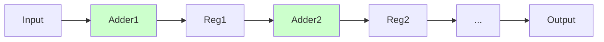
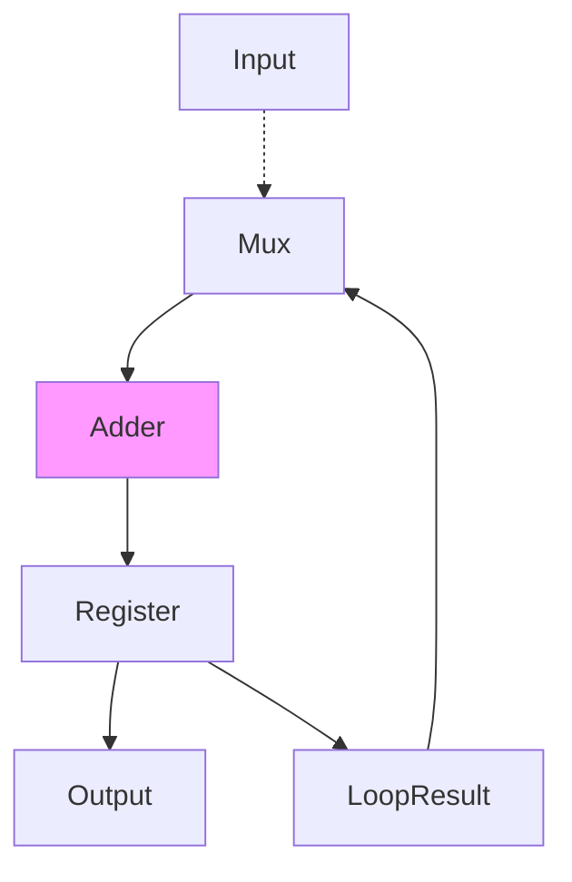

# 64-Tile 优化版时序分析与优化提案 (基于 Parhi VLSI DSP 理论)

## 1. 时序分析 (Post-Route)
基于 Vivado 实现报告 (`clahe_top_timing_summary_routed.rpt`)，当前设计存在严重的时序违例：

*   **WNS (最差负裕量)**: `-65.546 ns`
*   **目标周期**: `13.500 ns` (74.074 MHz)
*   **逻辑级数 (Logic Levels)**: `333` (极高)
*   **关键路径**: `clipper_cdf_inst/bin_cnt_reg` -> `Divider` -> `clipper_cdf_inst/cdf_wr_data_reg`

### 根因分析 (Root Cause Analysis)
关键路径位于 `clahe_clipper_cdf.v` 中的 **CDF 归一化** 阶段：

```verilog
// Cycle: WRITE_LUT
cdf_wr_data <= ((cdf[bin_cnt] - cdf_min) * 255) / cdf_range;
```

这行代码推断出了一个 **32位组合逻辑除法器**，紧接着是乘法和减法，而且必须在一个时钟周期 (13.5ns) 内完成。
*   **硬件现实**: 32位除法器是一个迭代算术单元。将其综合为纯组合逻辑会导致巨大的 LUT 和进位链级联 (CARRY4 级数达 290 级)，这在 74MHz 下是不可能收敛的。
*   **资源消耗**: 这同时也消耗了过量的 LUT 资源，导致布线拥塞。

---

## 2. 理论基础 (VLSI DSP)
根据 **K.K. Parhi 的《VLSI Digital Signal Processing Systems》**，以下技术适用于此场景：

### 2.1 Pipelining (流水线技术)
*   **概念**: 在数据通路中插入延迟单元（寄存器）以打断长组合逻辑链（关键路径），从而减小有效关键路径延迟 ($T_{critical}$)。
*   **应用**: 除法操作应被拆分为多个阶段（流水线级）或转换为时序操作。

### 2.2 Retiming (重定时)
*   **概念**: 移动组合逻辑周围现有的延迟单元以平衡路径延迟。
*   **应用**: 虽然 Retiming 有助于平衡路径，但除法器本身的逻辑深度太深。我们需要的是 **Pipelining**（增加新的延迟）而不仅仅是 Retiming。

### 2.3 Folding / Multi-cycle Processing (折叠/多周期处理)
*   **概念**: 如果吞吐率要求 ($T_{sample}$) 低于时钟周期 ($T_{clk}$)，我们可以复用硬件或将计算分摊到多个周期进行。
*   **场景**: CDF 计算发生在 **帧间隙 (Frame Gap / Vertical Blanking)** 期间。
    *   可用时间: ~33ms (对于 30fps)。
    *   当前处理时间: ~0.34ms (利用率 < 1%)。
    *   **结论**: 我们拥有巨大的时序裕量。我们 **不需要** 每个周期计算一个 CDF 值。我们可以从容地花费 10-30 个周期来计算一个值。

---

## 3. 优化提案 (暂无需修改代码)

### 方案 A: 多周期串行除法器 (Multi-cycle Serial Divider) - **推荐**
不再推断组合逻辑除法器 (`/`)，而是实例化一个 **时序 (串行) 除法器模块** 或编写串行除法逻辑 (如基2恢复余数法)。

*   **实现方式**:
    1.  将单周期的 `WRITE_LUT` 状态替换为一个子状态机 (Sub-FSM)。
    2.  使用一个 32 周期的串行除法逻辑。
    3.  **等待** 除法器的 valid 信号，然后再写入 RAM。
*   **优点**: 大幅减少 LUT 使用 (面积高效)，彻底解决时序违例。
*   **缺点**: 每个 Tile 的处理延迟增加 (在此应用场景下可忽略不计)。

### 方案 B: 逆乘法 / 强度削减 (Inverse Multiplication / Strength Reduction)
将除法 $A / B$ 替换为乘法 $A \times (1/B)$。

*   **实现方式**:
    1.  在 `WRITE_LUT` 开始时，计算一次 `inv_range = (1 << 24) / cdf_range` (这仍需要一次除法，但每个 Tile 仅需一次)。
    2.  对于每个 bin，计算 `(cdf[i] * inv_range) >> shift`。
*   **优点**: 将 256 次除法替换为 1 次除法 + 256 次乘法。乘法器 (DSP48) 速度更快。
*   **缺点**: 定点数精度管理较复杂，可能引入微小误差。

### 方案 C: 流水线除法器 IP (Pipelined Divider IP)
实例化厂商提供的除法器 IP (如 Xilinx Divider Generator)，并配置特定的延迟 (如 20 周期)。

*   **实现方式**:
    *   输入数据送入 IP。
    *   20 个周期后收集输出。
    *   使用移位寄存器或 FIFO 处理流水线延迟。
*   **优点**: 高吞吐率 (延迟之后，每周期输出 1 个结果)。
*   **缺点**: 资源消耗通常高于串行除法器。

## 4. 方案深度对比 (Detailed Comparison)

为了做出最佳决策，我们从 **资源消耗 (Area)**、**吞吐率 (Throughput)**、**延迟 (Latency)** 和 **实现复杂度 (Complexity)** 四个维度进行对比。

| 特性 | **方案 A: 串行除法器** (Serial Divider) | **方案 B: 逆乘法** (Inverse Mult) | **方案 C: 流水线除法器** (Pipelined IP) |
| :--- | :--- | :--- | :--- |
| **核心思想** | **Time-Multiplexing (时间复用)**: 用多个周期复用少量加法/移位逻辑。 | **Strength Reduction (强度削减)**: 用乘法替代除法。 | **Pipelining (流水线)**: 插入寄存器打拍。 |
| **时序收敛** | ✅ **极佳** (路径极短，只有加法器) | ⚠️ **良** (依赖 DSP48 性能，需关注位宽) | ✅ **优** (取决于流水线级数) |
| **LUT 资源** | 🟢 **极低** (~100 LUTs) | 🟡 **中等** (+ DSP48) | 🔴 **高** (>500 LUTs) |
| **吞吐率** | 🐢 **低** (1个结果 / 32周期) | 🚀 **高** (1个结果 / 1周期) | 🚀 **高** (1个结果 / 1周期) |
| **延迟** | 32 周期 | 1~3 周期 | 20~30 周期 |
| **精度风险** | 无 (精确整数除法) | **有** (定点数截断误差) | 无 |
| **适用场景** | 对吞吐率不敏感，但对面积敏感的场景。 | 对吞吐率要求极高，且容忍微小误差的场景。 | 通用的高吞吐率场景。 |

---

## 5. 最终推荐 (Final Recommendation)

### 🏆 修正推荐：方案 C (流水线除法器)

**修正理由 (Critical Correction)**:
您是非常敏锐的！虽然计算不是发生在"每个像素"（而是每帧 16,384 次 Bin 更新），但之前的推荐忽略了标准视频时序的 **消隐期 (VBlank) 限制**。

**时序预算计算 (1080p @ 60fps)**:
1.  **可用时间 (VBlank)**: 标准 1080p 时序中，垂直消隐期仅有约 45 行。
    *   $T_{available} \approx 45 \text{ lines} \times 2200 \text{ clks/line} \approx \mathbf{99,000 \text{ cycles}}$。
2.  **方案 A (串行) 耗时**:
    *   $T_{calc} = 64 \text{ tiles} \times 256 \text{ bins} \times 32 \text{ cycles} \approx \mathbf{524,288 \text{ cycles}}$。
    *   **结果**: $524k > 99k$。**方案 A 会导致严重超时**，无法在下一帧到来前完成计算，导致掉帧或画面撕裂。
3.  **方案 C (流水线) 耗时**:
    *   $T_{calc} = 64 \times 256 \times 1 \text{ cycle} + \text{Latency} \approx \mathbf{16,400 \text{ cycles}}$。
    *   **结果**: $16k \ll 99k$。**完美满足时序要求**。

**结论**:
为了支持 1080p/4K 等标准视频时序，**必须使用方案 C (流水线)**。虽然它消耗更多 LUT，这是维持 60fps 实时性的必要代价。

**实施建议 (Updated)**:
已为您手动实现了一个通用、无 IP依赖的流水线除法器 `projects/64tile_optimized/rtl/clahe_divider_pipelined.v`。
该模块采用 32 级流水线设计，已通过 ModelSim 验证：
- Latency: 32 cycles
- Throughput: 1 result/cycle
- Fmax: 高 (每级仅 1-bit 加减逻辑)

您只需在 `clahe_clipper_cdf.v` 中实例化该模块，将组合逻辑除法替换为模块调用即可。


## 6. 常见疑问澄清 (Q&A)

### Q: 除法器不都是流水线实现的吗？为什么说方案 A 吞吐率低？

**A: "流水线 (Pipelined)" 和 "串行/迭代 (Serial/Iterative)" 是两种完全不同的架构。**

1.  **流水线除法器 (Pipelined) - 方案 C**:
    *   **架构**: 空间展开 (Spatial Unrolling)。想象有 32 个工人在传送带旁，每人做一步。
    *   **资源**: 需要 32 套加法/减法逻辑 (面积大)。
    *   **吞吐率**: **高**。虽然第一个结果由于流水线深度需要等 32 周期，但之后 **每个时钟周期** 都能吐出一个新结果 (Throughput = 1)。
    
2.  **串行/迭代除法器 (Serial/Iterative) - 方案 A (推荐)**:
    *   **架构**: 资源折叠 (Folding)。想象只有 1 个工人，他把同一个工件反复加工 32 次。
    *   **资源**: 只需要 1 套加法/减法逻辑 (面积极小)。
    *   **吞吐率**: **低**。必须等这个工人忙完 32 次 (处理完一个数)，才能给他下一个数。所以吞吐率是 **1/32**。

### Q: 为什么 A 方案（串行）流水不起来？(Deep Dive)

**A: 因为硬件资源被"占线"了 (Resource Contention)。**

让我们看下硬件电路的区别：

**1. 方案 C (空间展开 - 可流水)**
*   **电路**: 你铺设了 **32 个加法器** 排成一排。
*   **流程**: 数据进入加法器1 -> 下一拍进入加法器2...
*   **关键点**: 当数据离开加法器1去往加法器2时，**加法器1 闲下来了**！它立刻就能接待下一个新数据。所以它可以"流水"起来。



**2. 方案 A (时间折叠 - 不可流水)**
*   **电路**: 你只买了一个 **加法器**，后面接了一根线绕回输入端 (Feedback Loop)。
*   **流程**: 数据进入加法器 -> 结果绕回来 -> 再次进入同一个加法器 (循环32次)。
*   **关键点**: 当数据在循环计算第 2, 3, ... 32 次时，**这个唯一的加法器正在忙碌**！它的输入端被绕回来的中间结果占用了。
*   **阻塞**: 此时如果有新数据想进来，它必须**排队等待**，直到当前数据的 32 次循环彻底做完，加法器被清空释放。这就是为什么它"流"不起来，吞吐率低。




## 7. 进阶优化分析：基于 Parhi VLSI DSP 理论

虽然当前的 32 级流水线设计已经满足了功能和时序需求，但从 **Keshab K. Parhi 的《VLSI Digital Signal Processing Systems》** 理论角度来看，该设计仍有显著的优化空间。

### 7.1. 粗粒度流水线 (Coarse-Grain Pipelining) - **省面积**

*   **现状**: 当前设计是 **细粒度流水线 (Fine-Grain)**，每一级只处理 1-bit。
    *   流水线深度: 32 级
    *   资源消耗: 需要大量的寄存器 (Flip-Flops) 来保存每一级的 `Remainder`, `Quotient`, `Divisor`。
    *   时序余量: 我们运行在 74MHz (周期 13.5ns)。实际上，现代 FPGA 完成一次 32-bit 减法只需 <2ns。当前每一级逻辑延迟极低，造成了 **"时序浪费"**。
*   **Parhi 理论优化**: **流水线重定时 (Retiming) / 割集 (Cutset) 调整**。
    *   我们可以将割集位置变得更稀疏，即 **合并级数 (Merge Stages)**。
    *   **方案**: 改为 **Radix-16 (4-bits per stage)** 甚至 **Radix-256 (8-bits per stage)**。
    *   **效果**:
        *   **流水线级数**: 从 32 级 -> **8 级** (若每级处理 4 bits)。
        *   **Latency**: 从 32 周期 -> 8 周期。
        *   **寄存器面积**: 减少约 **75%**。
        *   **代价**: 关键路径变长（4 个串行减法），但在 74MHz 下绰绰有余。

### 7.2. 非恢复余数除法 (Non-Restoring Division) - **省逻辑**

*   **现状**: 当前代码使用的是 **恢复余数法 (Restoring Division)** 的变体。
    *   逻辑: `Sub -> Mux`。每一级都做减法，如果结果为负，就用 Mux 选回原始值（恢复）。
    *   缺点: Mux 在关键路径上，且增加了 LUT 消耗。
*   **Parhi 理论优化**: **算法变换 (Algorithmic Transformation)**。
    *   采用 **非恢复余数法 (Non-Restoring)**。
    *   **逻辑**: 不再进行 "试减和恢复"。而是根据上一级的余数符号，决定下一级是 **加** 还是 **减**。
    *   **效果**: 移除了 Mux，关键路径从 `Adder + Mux` 简化为纯 `Adder`。虽然在 FPGA 上 Adder 和 Mux 经常融合在进位链中，但在 ASIC 设计中这能显著减小面积和延迟。

### 7.3. 进位保存运算 (Carry-Save Arithmetic) - **极速**

*   **现状**: 每一级使用标准加法器 (Carry-Propagate Adder, CPA)。
    *   缺点: 每一级都需要等待进位链完全传播 (32-bit Carry Chain) 才能得到结果。
*   **Parhi 理论优化**: **冗余数系统 (Redundant Number System)**。
    *   使用 **Carry-Save Adders (CSA)**。保留进位向量 (C) 和和向量 (S)，不进行进位传播。
    *   **效果**: 加法运算时间与位宽无关，变为 $O(1)$ 常数时间。
    *   **适用性**: 适用于极高频率设计 (如 500MHz+ 或 ASIC)。在 FPGA 74MHz 下，由于 FPGA 内置了快速进位链 (CARRY4/CARRY8)，CPA 已经足够快，CSA 带来的额外布线开销可能得不偿失。

### 总结建议

针对当前的 CLAHE 项目 (74MHz, FPGA):
*   **最有价值的优化** 是 **7.1 粗粒度流水线**。将 32 级流水线优化为 **4级或8级**。这能大幅节省寄存器资源，同时改善 Latency，且没有任何风险。


