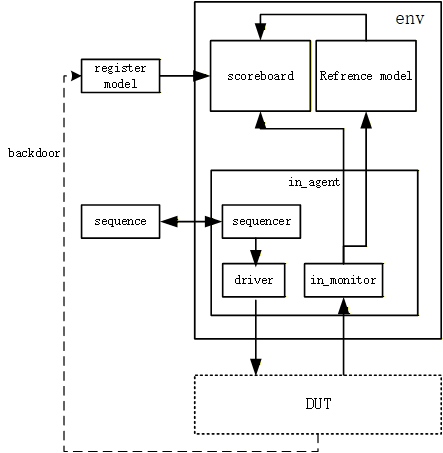

# CLAHE Histogram UVM 验证环境

本文档介绍了用于验证 CLAHE 直方图统计模块 (`clahe_histogram_stat`) 的 UVM 验证环境。该环境旨在验证模块在全尺寸图像输入下的统计正确性及冲突处理能力。

## 1. 验证架构

本环境基于标准 UVM 1.1d 方法学构建，采用 Scoreboard + Reference Model 的自动对比机制。



### 核心组件
- **`histogram_transaction`**: 定义了宽 (`width`)、高 (`height`) 及像素数据 (`in_y[]`)。支持 1280x720 等高清分辨率。
- **`histogram_driver`**: 模拟上位机行为，生成符合时序的 `HREF`, `VSYNC` 及像素数据流。
- **`histogram_monitor`**: 监测 DUT 接口，自动收集整帧图像数据并在帧结束时打包发送。
- **`histogram_reg_model`**: **(关键)** 通过 Backdoor (`uvm_hdl_read`) 直接读取 DUT 内部 RAM。具备智能 Ping-Pong 识别功能，自动读取“已完成”的一组 RAM 数据。
- **`histogram_model` (Ref)**: 软件参考模型，模拟理想的直方图统计逻辑。
- **`histogram_coverage`**: 功能覆盖率组件，专注于验证 RMW (Read-Modify-Write) 冲突。

## 2. 关键特性

### ✅ 全尺寸仿真 (Full Size Simulation)
环境支持 **1280x720** 分辨率的全尺寸仿真。
- **优化**：为了绕过仿真器对随机化数组大小的限制（通常为 10k），Transaction 采用了 `post_randomize()` 手动分配策略，支持百万级像素 (921,600) 的随机生成。

### ✅ 智能 Ping-Pong 校验
DUT 采用 Ping-Pong RAM 结构。
- **机制**：Scoreboard 在每一帧结束时，自动根据 DUT 当前的 `ping_pong_flag` 状态，计算出刚写完的那一组 RAM 地址 (`Set = 1 - pp_flag`) 进行 Backdoor 读取和比对，确保数据 100% 准确。

### ✅ 冲突处理覆盖率
针对直方图统计中最大的风险点——**地址冲突 (Same Bin Access)**，实现了专门的覆盖率模型。
- **Coverage**: `histogram_coverage.sv`
- **关注点**: 连续两个像素值相同 (`x => x`)，这将触发 RAM 的 RMW 机制。
- **结果**: 在全尺寸随机测试中，该覆盖率达到了 **100.00%**。

## 3. 如何运行

### 前置条件
- ModelSim 2020.4 或更高版本。
- 编译好的 UVM 1.1d 库。

### 运行步骤
1. 进入测试目录：
   ```bash
   cd e:\project\CLAHE_uvm\uvm_test
   ```
2. 启动仿真 (命令行模式)：
   ```bash
   vsim -c -do uvm.do
   ```
   或者在 GUI 模式下运行 `uvm.do` 脚本。

### 预期结果
仿真结束后，终端应显示：
```
# UVM_INFO histogram_coverage.sv ... [COVERAGE] Instance Coverage: 100.00%
# TEST CASE PASSED
# Errors: 0, Warnings: 0
```
这意味着 1280x720 图片的直方图统计结果与参考模型完全一致，且冲突场景已充分覆盖。

## 4. 文件列表
| 文件名 | 描述 |
| --- | --- |
| `top_tb.sv` | 顶层 Testbench |
| `histogram_env.sv` | 环境组件，连接各模块 |
| `histogram_case0.sv` | 测试用例 & Sequence |
| `histogram_transaction.sv` | 事务对象 (含大数组处理) |
| `histogram_driver.sv` | 驱动器 |
| `in_monitor.sv` | 监视器 |
| `histogram_scoreboard.sv` | 计分板 (比对逻辑) |
| `histogram_coverage.sv` | **(新增)** 覆盖率组件 |
| `histogram_reg_model.sv` | **(核心)** 寄存器与 Backdoor 访问 |
